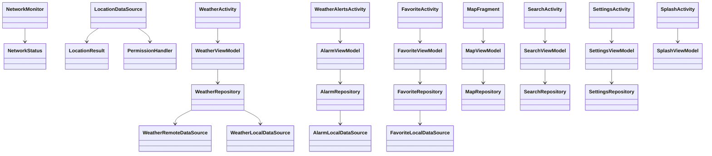

# 🌦️ Taqs360 - Weather Forecast Android App

**Taqs360** is a feature-rich Android application built with **Kotlin**, providing accurate weather forecasts alongside features like **weather alarms, search, favorite locations, map integration, and more**. The app follows a clean **MVVM (Model-View-ViewModel)** architecture with repository pattern and clean modularization, ensuring scalability, maintainability, and testability.

---


---

## 📸 Screenshots

<p align="center">
  
  
  
</p>

<p align="center">
  
  
  
</p>

<p align="center">
  
  
  
</p>

<p align="center">
  
  
  
</p>

<p align="center">
  
  
  
</p>

<p align="center">
  
  
  
</p>

<p align="center">
  
  
  
</p>

<p align="center">
  
  
  
</p>

<p align="center">
  
  
  
</p>

<p align="center">
  
  
  
</p>

<p align="center">
  
</p>


## 🚀 Features

- 📍 **Location-Based Forecasts**  
  Get current weather data based on your GPS location.

- 📡 **Real-Time Weather Updates**  
  Fetch up-to-date data from remote weather APIs.

- 📅 **Weather Alarms & Notifications**  
  Set alerts for extreme weather conditions.

- 🔍 **Search for Locations**  
  Search any city using Nominatim API with dynamic suggestions.

- 🗺️ **Interactive Map View**  
  Select and visualize locations on a map.

- ❤️ **Favorite Locations**  
  Save locations for quick future access.

- 🧠 **Clean Architecture**  
  Fully decoupled layers using MVVM and repository pattern.

- 💾 **Offline Caching**  
  Store weather and location data locally using Room DB.

- 📊 **Graphical Temperature Trends**  
  Visual representation of forecasts with custom graphs.

- 🌐 **Network Monitoring**  
  Automatically detects connection status.

---

## 🧠 Architecture Overview

The application is built using a **modular clean architecture** with the following key layers:

- **Model:** Data layer including network, local DB, and data sources.
- **ViewModel:** Business logic, exposed data, state management.
- **View:** Activities, Fragments, Adapters – tied to the UI lifecycle.
- **Repository:** Abstraction layer for accessing different data sources.

Each feature (e.g., weather, alarm, map) is isolated into a module-like package to ensure separation of concerns.

---

## 🗂️ Project Structure

```bash
.
├── alarm/
│   ├── model/
│   │   ├── AlarmData.kt, AlarmDao.kt, AppDatabase.kt, ...
│   ├── view/ → WeatherAlertsActivity.kt, DatePickerFragment.kt, ...
│   └── viewmodel/ → AlarmViewModel.kt, AlarmWorker.kt
├── favorite/
│   ├── model/ → FavoriteLocation.kt, DAO, repository, ...
│   ├── view/ → FavoriteActivity.kt, FavoriteAdapter.kt
│   └── viewmodel/ → FavoriteViewModel.kt
├── home/
│   ├── model/
│   │   ├── pojo/, remote/, local/, repository/
│   ├── view/ → WeatherActivity.kt, GraphDrawer.java, ForecastAdapter.kt
│   └── viewmodel/ → WeatherViewModel.kt
├── location/ → LocationDataSource.kt, LocationResult.kt, PermissionHandler.kt
├── map/
│   ├── model/ → LocationData.kt, repository, datasource/
│   ├── view/ → MapFragment.kt
│   └── viewmodel/ → MapViewModel.kt
├── network/ → NetworkMonitor.kt
├── search/
│   ├── model/ → NominatimService.kt, repository/, datasource/
│   ├── view/ → SearchActivity.kt, SearchAdapter.kt
│   └── viewmodel/ → SearchViewModel.kt
├── settings/
│   ├── model/ → Settings.kt, repository/, datasource/
│   ├── view/ → SettingsActivity.kt, SettingsFragment.kt
│   └── viewmodel/ → SettingsViewModel.kt
└── splash/
    ├── view/ → SplashActivity.kt
    └── viewmodel/ → SplashViewModel.kt
```

---

## 📈 Architecture Diagram



---

## 🔄 Dependencies & Tech Stack

- **Language:** Kotlin  
- **Architecture:** MVVM + Clean Architecture + Repository Pattern  
- **UI:** Material Components, Fragments, RecyclerView, GraphView  
- **Persistence:** Room Database  
- **Networking:** Retrofit, Coroutines  
- **Location:** Fused Location Provider, Nominatim API  
- **Map:** Google Maps or OpenStreetMap (via MapFragment)  
- **Alarm & Alerts:** AlarmManager + WorkManager  
- **Others:** LiveData, ViewModel, Factory, BroadcastReceiver  

---

## 🧪 Testing & Debugging

- **ViewModel Tests:** Unit tested using JUnit and mock data sources.  
- **Repository Tests:** Mocked both Room DB and Retrofit APIs.  
- **Manual UI Testing:** Verified using various emulators and real devices.


---


## 🙌 Credits
Powered by: OpenWeatherMap, Nominatim, AndroidX, and Jetpack Libraries.
